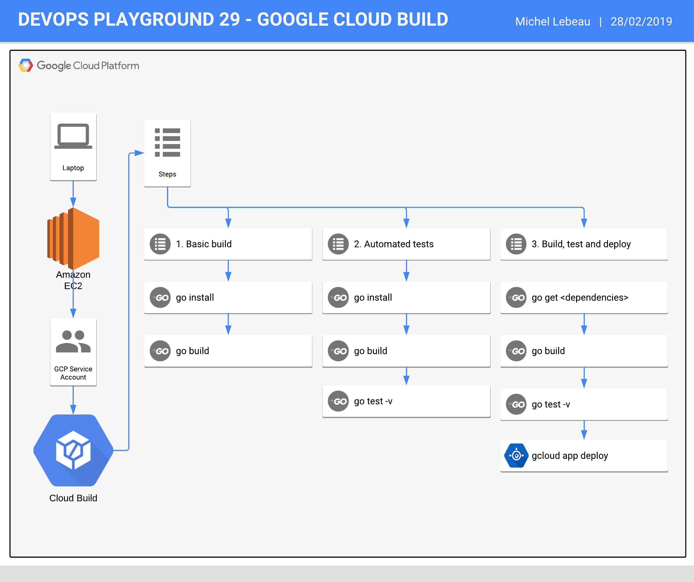

# DevOps Playground 29 - Hands On with GCP Cloud Build

## What we will build 


### Stage 1
We will build a simple hello world application.

### Stage 2
We will build and automatically test the same simple hello world application.

### Stage 3
We will build, test and deploy a simple web application to Google App Engine.


## Pre-requisites
This is for your information only, this has already been done for you.
This can definitely be improved, but hey, if it works...

### APIs needed to be activated
Identity and Access Management (IAM) API  
Google Cloud Storage JSON API    
CloudBuild API  
App Engine API  
Cloud Resource Manager API  
Google App Engine Flexible Environment

### Individual service accounts permissions needed
App Engine Admin - roles/appengine.appAdmin  
App Engine Deployer - roles/appengine.deployer  
Cloud Build Service Account - roles/cloudbuild.builds.builder  
Cloud Build Editor - roles/cloudbuild.builds.editor  
Compute Instance Admin (beta) - roles/compute.instanceAdmin  
Service Accounts User - roles/iam.serviceAccountUser  
Project Owner - roles/owner  
Project Viewer - roles/viewer  
Storage Admin - roles/storage.admin  
Storage Object Admin - roles/storage.objectAdmin  
Storage Object Creator - roles/storage.objectCreator  
Storage Object Viewer - roles/storage.objectViewer  


### Root service account permissions needed  
Cloud Build Service Account  
Cloud Build Editor  
Editor  
Role Administrator  
Service Account Admin  
Delete Service Accounts  
Service Account Key Admin  
Project IAM Admin  
Storage Admin  
App Engine Deployer  
Project Owner  


### Creating the default App Engine service
This needs to be done only once in a project  
`gcloud app create --region=europe-west`


## Hands On!

### Connecting to our workstations and first look around
SSH into your workstation

Go into the project directory available in your home directory:  
`cd project`

Have a look at all the files present under your current directory:  
```
playground@dpg-ldn-29-pony:~/project$ tree
.
├── app1
│   ├── cloudbuild.yaml
│   └── main.go
├── app2
│   ├── cloudbuild.yaml
│   ├── main.go
│   └── main_test.go
├── app3
│   ├── app.yaml
│   ├── cloudbuild.yaml
│   ├── main.go
│   └── main_test.go
└── README.md

3 directories, 10 files
```

### Stage 1 - Basic build
Go into the app1 directory:  
`cd app1`  

Look at the content of our application:  
`cat main.go`  
Output:  
```
package main

import "fmt"

// Hello returns a nice hello world message
func Hello() string {
	return "Hello, world"
}

func main() {
	fmt.Println(Hello())
}
```

Now let's have a look at our Cloud Build configuration:  
```
playground@dpg-ldn-29-pony:~/project/app1$ cat cloudbuild.yaml
steps:
- name: 'gcr.io/cloud-builders/go'
  args: ['install', '.']
  env: ['PROJECT_ROOT=playground']
- name: 'gcr.io/cloud-builders/go'
  args: ['build', 'playground']
  env: ['PROJECT_ROOT=playground']
```

Let's now submit our built to Cloud Build:  
`gcloud builds submit --config cloudbuild.yaml`  
Build Output:  
```
Creating temporary tarball archive of 2 file(s) totalling 361 bytes before compression.
Uploading tarball of [.] to [gs://u0j5fddpa-gcp-sandpit-921579_cloudbuild/source/1551021385.19-5b0c46f04d8e42dd92cfd42e02702fc2.tgz]
Created [https://cloudbuild.googleapis.com/v1/projects/u0j5fddpa-gcp-sandpit-921579/builds/dfa13629-d5e8-4c6c-8921-69fb9a7c31a6].
Logs are available at [https://console.cloud.google.com/gcr/builds/dfa13629-d5e8-4c6c-8921-69fb9a7c31a6?project=358931386078].
---------------------------------------------------------------------------------- REMOTE BUILD OUTPUT ----------------------------------------------------------------------------------
starting build "dfa13629-d5e8-4c6c-8921-69fb9a7c31a6"

FETCHSOURCE
Fetching storage object: gs://u0j5fddpa-gcp-sandpit-921579_cloudbuild/source/1551021385.19-5b0c46f04d8e42dd92cfd42e02702fc2.tgz#1551021385811796
Copying gs://u0j5fddpa-gcp-sandpit-921579_cloudbuild/source/1551021385.19-5b0c46f04d8e42dd92cfd42e02702fc2.tgz#1551021385811796...
/ [1 files][  367.0 B/  367.0 B]
Operation completed over 1 objects/367.0 B.
BUILD
Starting Step #0
Step #0: Already have image (with digest): gcr.io/cloud-builders/go
Step #0: Creating shadow workspace and symlinking source into "./gopath/src/playground".
Step #0: Documentation at https://github.com/GoogleCloudPlatform/cloud-builders/blob/master/go/README.md
Step #0: Binaries built using 'go install' will go to "/workspace/gopath/bin".
Step #0: Running: go install .
Finished Step #0
Starting Step #1
Step #1: Already have image (with digest): gcr.io/cloud-builders/go
Step #1: Creating shadow workspace and symlinking source into "./gopath/src/playground".
Step #1:   File: './gopath/src/playground' -> '/workspace'
Step #1:   Size: 10        	Blocks: 0          IO Block: 4096   symbolic link
Step #1: Device: 801h/2049d	Inode: 19611654    Links: 1
Step #1: Access: (0777/lrwxrwxrwx)  Uid: (    0/    root)   Gid: (    0/    root)
Step #1: Access: 2019-02-24 15:16:37.000000000
Step #1: Modify: 2019-02-24 15:16:37.000000000
Step #1: Change: 2019-02-24 15:16:37.000000000
Step #1:
Step #1: Documentation at https://github.com/GoogleCloudPlatform/cloud-builders/blob/master/go/README.md
Step #1: Running: go build playground
Finished Step #1
PUSH
DONE
-----------------------------------------------------------------------------------------------------------------------------------------------------------------------------------------

ID                                    CREATE_TIME                DURATION  SOURCE                                                                                                  IMAGES  STATUS
dfa13629-d5e8-4c6c-8921-69fb9a7c31a6  2019-02-24T15:16:26+00:00  13S       gs://u0j5fddpa-gcp-sandpit-921579_cloudbuild/source/1551021385.19-5b0c46f04d8e42dd92cfd42e02702fc2.tgz  -       SUCCESS
```

It looks like our application builds successfully, well done!

Checkpoint:
1. What is missing?
2. What could we do to speed the build up when running this build several times?

### Stage 2 - Automated tests

Now that we can do a very basic build, let's add some automated tests (very basic too!).  
Let's jump into our next directory:  
`cd ../app2`  

Let's look at the content of our app now:  
```
playground@dpg-ldn-29-pony:~/project/app2$ cat main.go
package main

import "fmt"

// Hello returns a nice hello world message
func Hello() string {
	return "Hello, world"
}

func main() {
	fmt.Println(Hello())
}
```

Let's take a look at our test:  
```
playground@dpg-ldn-29-pony:~/project/app2$ cat main_test.go
package main

import "testing"

func TestHello(t *testing.T) {
	got := Hello()
	want := "Hello, world"

	if got != want {
		t.Errorf("got '%s' want '%s'", got, want)
	}
}
```

And let's look at our build configuration now:  
```
playground@dpg-ldn-29-pony:~/project/app2$ cat cloudbuild.yaml
steps:
- name: 'gcr.io/cloud-builders/go'
  args: ['install', '.']
  env: ['PROJECT_ROOT=playground']
- name: 'gcr.io/cloud-builders/go'
  args: ['build', 'playground']
  env: ['PROJECT_ROOT=playground']
- name: 'gcr.io/cloud-builders/go'
  args: ['test', '-v', 'playground']
  env: ['PROJECT_ROOT=playground']
```

Let's now run Cloud Build:  
```
playground@dpg-ldn-29-pony:~/project/app2$ gcloud builds submit --config cloudbuild.yaml
Creating temporary tarball archive of 3 file(s) totalling 639 bytes before compression.
Uploading tarball of [.] to [gs://u0j5fddpa-gcp-sandpit-921579_cloudbuild/source/1551021505.9-d1767220ff1a413eb5b4a5985ace1372.tgz]
Created [https://cloudbuild.googleapis.com/v1/projects/u0j5fddpa-gcp-sandpit-921579/builds/4c04cd63-12ce-4899-8390-d5a20fa03c64].
Logs are available at [https://console.cloud.google.com/gcr/builds/4c04cd63-12ce-4899-8390-d5a20fa03c64?project=358931386078].
---------------------------------------------------------------------------------- REMOTE BUILD OUTPUT ----------------------------------------------------------------------------------
starting build "4c04cd63-12ce-4899-8390-d5a20fa03c64"

FETCHSOURCE
Fetching storage object: gs://u0j5fddpa-gcp-sandpit-921579_cloudbuild/source/1551021505.9-d1767220ff1a413eb5b4a5985ace1372.tgz#1551021506575595
Copying gs://u0j5fddpa-gcp-sandpit-921579_cloudbuild/source/1551021505.9-d1767220ff1a413eb5b4a5985ace1372.tgz#1551021506575595...
/ [1 files][  481.0 B/  481.0 B]
Operation completed over 1 objects/481.0 B.
BUILD
Starting Step #0
Step #0: Already have image (with digest): gcr.io/cloud-builders/go
Step #0: Creating shadow workspace and symlinking source into "./gopath/src/playground".
Step #0: Documentation at https://github.com/GoogleCloudPlatform/cloud-builders/blob/master/go/README.md
Step #0: Binaries built using 'go install' will go to "/workspace/gopath/bin".
Step #0: Running: go install .
Finished Step #0
Starting Step #1
Step #1: Already have image (with digest): gcr.io/cloud-builders/go
Step #1: Creating shadow workspace and symlinking source into "./gopath/src/playground".
Step #1:   File: './gopath/src/playground' -> '/workspace'
Step #1:   Size: 10        	Blocks: 0          IO Block: 4096   symbolic link
runtime: go
Step #1: Device: 801h/2049d	Inode: 19611655    Links: 1
Step #1: Access: (0777/lrwxrwxrwx)  Uid: (    0/    root)   Gid: (    0/    root)
Step #1: Access: 2019-02-24 15:18:36.000000000
Step #1: Modify: 2019-02-24 15:18:36.000000000
Step #1: Change: 2019-02-24 15:18:36.000000000
Step #1:
Step #1: Documentation at https://github.com/GoogleCloudPlatform/cloud-builders/blob/master/go/README.md
Step #1: Running: go build playground
Finished Step #1
Starting Step #2
Step #2: Already have image (with digest): gcr.io/cloud-builders/go
Step #2: Creating shadow workspace and symlinking source into "./gopath/src/playground".
Step #2:   File: './gopath/src/playground' -> '/workspace'
Step #2:   Size: 10        	Blocks: 0          IO Block: 4096   symbolic link
Step #2: Device: 801h/2049d	Inode: 19611655    Links: 1
Step #2: Access: (0777/lrwxrwxrwx)  Uid: (    0/    root)   Gid: (    0/    root)
Step #2: Access: 2019-02-24 15:18:36.000000000
Step #2: Modify: 2019-02-24 15:18:36.000000000
Step #2: Change: 2019-02-24 15:18:36.000000000
Step #2:
Step #2: Documentation at https://github.com/GoogleCloudPlatform/cloud-builders/blob/master/go/README.md
Step #2: Running: go test -v playground
Step #2: === RUN   TestHello
Step #2: --- PASS: TestHello (0.00s)
Step #2: PASS
Step #2: ok  	playground	0.002s
Finished Step #2
PUSH
DONE
-----------------------------------------------------------------------------------------------------------------------------------------------------------------------------------------

ID                                    CREATE_TIME                DURATION  SOURCE                                                                                                 IMAGES  STATUS
4c04cd63-12ce-4899-8390-d5a20fa03c64  2019-02-24T15:18:27+00:00  15S       gs://u0j5fddpa-gcp-sandpit-921579_cloudbuild/source/1551021505.9-d1767220ff1a413eb5b4a5985ace1372.tgz  -       SUCCESS
```

We now have a build pipeline that automatically builds our application and tests it.  
Checkpoint:
1. What kind of test is that?
2. What other kinds of test could we add?

### Stage 3 - Build, test and deploy

Let's now try to deploy our application as part of the pipeline.

Look at your application:  
```
playground@dpg-ldn-29-pony:~/project/app3$ cat main.go
package main

import (
	"fmt"
	"net/http"

	"google.golang.org/appengine"
)

// Server always prints Hello DevOps Playground!
func Server(w http.ResponseWriter, r *http.Request) {
	fmt.Fprint(w, "Hello DevOps Playground!")
}

func main() {
	http.HandleFunc("/", Server)
	appengine.Main()
}
```

Look at your automated test, notice it's been updated to follow the application code:  
```
playground@dpg-ldn-29-pony:~/project/app3$ cat main_test.go
package main

import (
	"net/http"
	"net/http/httptest"
	"testing"
)

func TestServer(t *testing.T) {
	request, _ := http.NewRequest(http.MethodGet, "/", nil)
	response := httptest.NewRecorder()

	Server(response, request)

	t.Run("Get server response", func(t *testing.T) {
		got := response.Body.String()
		want := "Hello DevOps Playground!"

		if got != want {
			t.Errorf("got '%s', want '%s'", got, want)
		}
	})

}
```

Look at the new build configuration:  
```
playground@dpg-ldn-29-pony:~/project/app3$ cat cloudbuild.yaml
steps:
- name: 'gcr.io/cloud-builders/go'
  args: ['get', 'google.golang.org/appengine']
  env: ['GOPATH=/gopath']
  volumes:
  - name: 'go'
    path: '/gopath'
- name: 'gcr.io/cloud-builders/go'
  args: ['build']
  env: ['GOPATH=/gopath']
  volumes:
  - name: 'go'
    path: '/gopath'
- name: 'gcr.io/cloud-builders/go'
  args: ['test', '-v']
  env: ['GOPATH=/gopath']
  volumes:
  - name: 'go'
    path: '/gopath'
- name: 'gcr.io/cloud-builders/gcloud'
  args: ['app', 'deploy']
  env: ['GOPATH=/gopath']
  volumes:
  - name: 'go'
    path: '/gopath'
```

And look at the `app.yaml` file:  
```
playground@dpg-ldn-29-pony:~/project/app3$ cat app.yaml
runtime: go
api_version: go1
service: default
handlers:
- url: /.*
  script: _go_app
```

We are all using the exact same Google Cloud Project, so we will need to update the service to all point to a different one:  
Edit app.yaml file and change `service: default` to: `service: <animal-name>`, replacing <animal-name> with the name of your animal, doing either `vi app.yaml` or `nano app.yaml`

Let's now run our build:  
`gcloud builds submit --config cloudbuild.yaml`  
This is the output that you should see, if it fails verify your service name:  
```
Creating temporary tarball archive of 4 file(s) totalling 1.3 KiB before compression.
Uploading tarball of [.] to [gs://u0j5fddpa-gcp-sandpit-921579_cloudbuild/source/1551021617.88-14170fb85fa140b1b55dbd5963607539.tgz]
Created [https://cloudbuild.googleapis.com/v1/projects/u0j5fddpa-gcp-sandpit-921579/builds/43d143b9-2a14-46c2-b1e1-c6dd64c665cf].
Logs are available at [https://console.cloud.google.com/gcr/builds/43d143b9-2a14-46c2-b1e1-c6dd64c665cf?project=358931386078].
---------------------------------------------------------------------------------- REMOTE BUILD OUTPUT ----------------------------------------------------------------------------------
starting build "43d143b9-2a14-46c2-b1e1-c6dd64c665cf"

FETCHSOURCE
Fetching storage object: gs://u0j5fddpa-gcp-sandpit-921579_cloudbuild/source/1551021617.88-14170fb85fa140b1b55dbd5963607539.tgz#1551021618489755
Copying gs://u0j5fddpa-gcp-sandpit-921579_cloudbuild/source/1551021617.88-14170fb85fa140b1b55dbd5963607539.tgz#1551021618489755...
/ [1 files][  772.0 B/  772.0 B]
Operation completed over 1 objects/772.0 B.
BUILD
Starting Step #0
Step #0: Already have image (with digest): gcr.io/cloud-builders/go
Step #0: Documentation at https://github.com/GoogleCloudPlatform/cloud-builders/blob/master/go/README.md
Step #0: Running: go get google.golang.org/appengine
Finished Step #0
Starting Step #1
Step #1: Already have image (with digest): gcr.io/cloud-builders/go
Step #1: Documentation at https://github.com/GoogleCloudPlatform/cloud-builders/blob/master/go/README.md
Step #1: Running: go build
Finished Step #1
Starting Step #2
Step #2: Already have image (with digest): gcr.io/cloud-builders/go
Step #2: Documentation at https://github.com/GoogleCloudPlatform/cloud-builders/blob/master/go/README.md
Step #2: Running: go test -v
Step #2: === RUN   TestServer
Step #2: === RUN   TestServer/Get_server_response
Step #2: --- PASS: TestServer (0.00s)
Step #2:     --- PASS: TestServer/Get_server_response (0.00s)
Step #2: PASS
Step #2: ok  	_/workspace	0.004s
package main
Finished Step #2
package main
Starting Step #3
Step #3: Already have image (with digest): gcr.io/cloud-builders/gcloud
Step #3: Services to deploy:
Step #3:
Step #3: descriptor:      [/workspace/app.yaml]
Step #3: source:          [/workspace]
Step #3: target project:  [u0j5fddpa-gcp-sandpit-921579]
Step #3: target service:  [pony]
Step #3: target version:  [20190224t152052]
Step #3: target url:      [https://pony-dot-u0j5fddpa-gcp-sandpit-921579.appspot.com]
Step #3:
Step #3:
Step #3: Do you want to continue (Y/n)?
Step #3: Beginning deployment of service [pony]...
Step #3: #============================================================#
Step #3: #= Uploading 2 files to Google Cloud Storage                =#
Step #3: #============================================================#
Step #3: File upload done.
Step #3: Updating service [pony]...
Step #3: ..............................................................................................................................done.
Step #3: Setting traffic split for service [pony]...
Step #3: ................................done.
Step #3: Deployed service [pony] to [https://pony-dot-u0j5fddpa-gcp-sandpit-921579.appspot.com]
Step #3:
Step #3: You can stream logs from the command line by running:
Step #3:   $ gcloud app logs tail -s pony
Step #3:
Step #3: To view your application in the web browser run:
Step #3:   $ gcloud app browse -s pony --project=u0j5fddpa-gcp-sandpit-921579
Finished Step #3
PUSH
DONE
-----------------------------------------------------------------------------------------------------------------------------------------------------------------------------------------

ID                                    CREATE_TIME                DURATION  SOURCE                                                                                                  IMAGES  STATUS
43d143b9-2a14-46c2-b1e1-c6dd64c665cf  2019-02-24T15:20:19+00:00  1M7S      gs://u0j5fddpa-gcp-sandpit-921579_cloudbuild/source/1551021617.88-14170fb85fa140b1b55dbd5963607539.tgz  -       SUCCESS
```

You can now look at the URL highlighted in **Deployed service [pony] to...** and see the output of your application.

If we still have time, edit your `main.go` and `main_test.go` files and change the "Hello World" message to something of your choice.  
Make sure the same text is in the two places, then run `gcloud builds submit --config cloudbuild.yaml` again.
After the run finished you will be able to see that your application has been updated!
